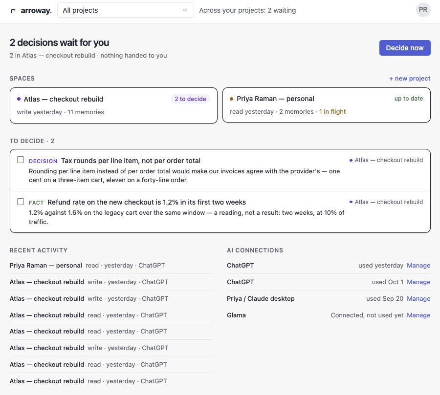
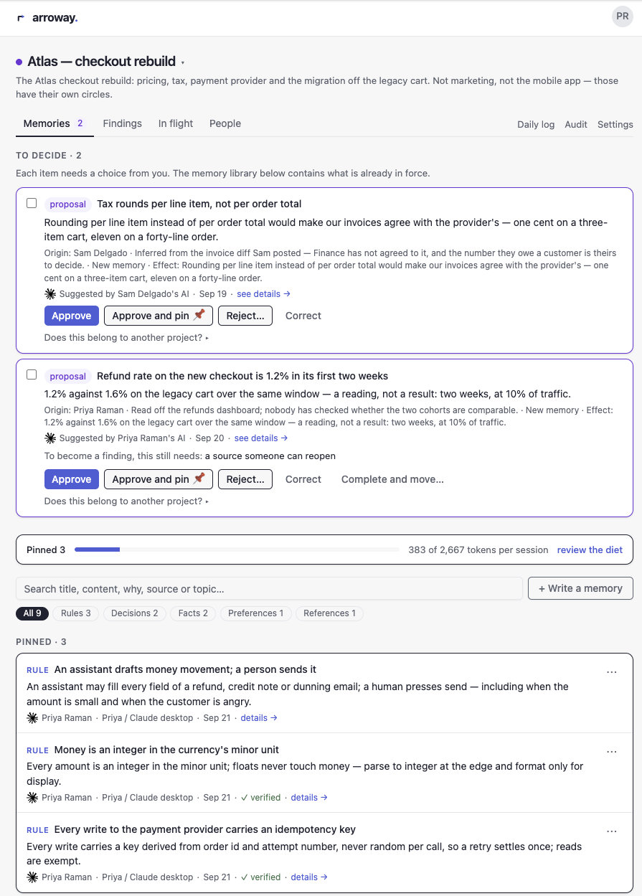
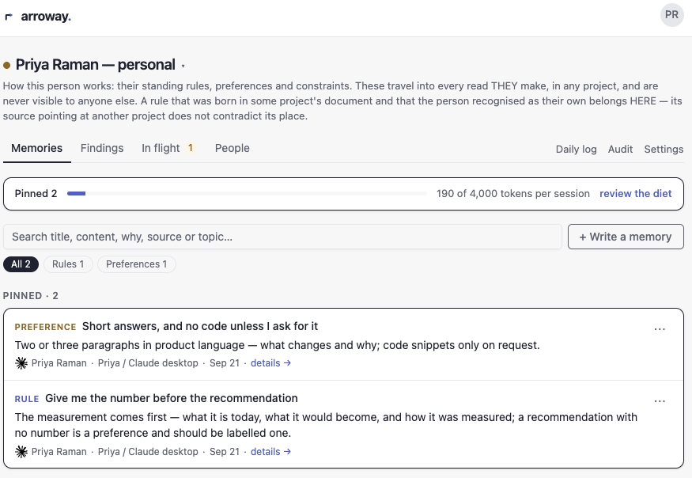

# Arroway — plugin

[Arroway](https://www.arroway.app) orchestrates people and AI agents around the decisions in force.

**English** · [Español](#español) · [Português](#português)

Your team writes down what it decided; every teammate's AI reads it before it acts, and leaves behind what someone arriving later would need in order not to redo the work.

This repository is the plugin: the connection to Arroway, the working protocol, and the hooks that make an assistant read before it changes anything and record when it finishes.

## Install

### Claude Code and Cowork

```
claude plugin marketplace add oaleviola/arroway-plugin
```

```
claude plugin install arroway@arroway
```

Nothing to paste, and no separate connector to install: the package carries the connection to Arroway's own address. It starts signed out, so sign in once. In Claude Code, run `/mcp`, choose `plugin:arroway:arroway` and follow the sign-in in the browser. Approve the connection as yourself, and the memory your assistant writes from then on carries your name. Until you sign in, Arroway's tools do not appear and nothing is read or recorded. If Arroway is already connected to your Claude account as a connector and its tools already show up, you can skip this step.

### Cursor

Add `https://github.com/oaleviola/arroway-plugin` as a plugin marketplace in Cursor, then install **arroway** from the plugin list.

Nothing to paste here: the Cursor package carries Arroway's own address and signs you in through the browser the first time it needs you. Approve the connection as yourself, and the memory your assistant writes from then on carries your name.

### Claude in the browser or on your phone

You don't need this repository: add Arroway as a connector instead, from the same Connections page.

### The skill alone, in any agent that reads skills

If your agent reads agent skills but there is no Arroway plugin for it, add the workflow skill with the [skills](https://skills.sh) CLI:

```
npx skills add oaleviola/arroway-plugin
```

The skill teaches your agent to read Arroway before acting and to close each task. It still needs Arroway connected as an MCP server at `https://www.arroway.app/api/mcp`. Where your client has the plugin, use the plugin: it brings the connection and the hooks too.

### Asking an AI agent to install it

Point it to [llms-install.md](llms-install.md): the steps for each client, written for an agent, Cline and any other MCP client included.

## Using it

Once you are signed in there is nothing to call by hand: the skill tells your assistant when to use Arroway. It happens at four moments, and this is what each one looks like.

1. **Before it acts.** You ask: *"Draft the pricing page for the new plan."* The assistant first calls `arroway_read` for your project and answers from what the team already decided. If two decisions conflict, it tells you instead of picking one.
2. **Before it commits to a claim.** `arroway_norms` returns what is already decided, at a fraction of the cost of a full read, right before the assistant tells you something or proposes a course of action.
3. **When it finishes.** `arroway_log` records what someone arriving later would need in order not to redo the work. If nothing durable came out of the task, the assistant says so in one sentence: *No durable residue.*
4. **When it stops without finishing.** `arroway_pass` leaves where the work stands, the single next step, what must not be redone and the risk still open. The next person's assistant finds it at the top of its first read and takes it with `arroway_claim`.

You can also ask for these directly:

- *"Catch me up on what happened across my projects this week."* — `arroway_catch_up`
- *"Where did we talk about the pricing change?"* — `arroway_search_log`
- *"Remember that we don't discount annual plans."* — `arroway_remember`. What you state yourself is recorded as your decision; what an assistant proposes on its own waits for a person to approve it.

A short example: one assistant researches a pricing change and records a proposal. A person approves the decision. Another assistant drafts the pricing page using that decision, and the next person can see what was decided, who approved it and what remains open.

### What it looks like

Screens from a demo account with sample data.

**What waits for you, across projects.** Decisions an assistant proposed sit in one place until a person decides.



**Inside a project.** An assistant's proposals wait for approval (approve, approve and pin, reject or correct), and the rules the team pinned are what every connected assistant reads first.



**Your own standing rules.** How you work travels with you into every project, and no one else sees it.



## What is in here

- `plugin/skills/` — the working protocol: read before acting, record when a task ends, hand work forward when you stop
- `plugin/hooks/` — the gates that ask for those two moments instead of only describing them
- `plugin/.mcp.json` — the Claude Code connection, which uses Arroway's own address; identity comes from signing in
- `plugin/.cursor-plugin/`, `plugin/cursor-mcp.json`, `plugin/hooks/cursor-hooks.json` — the same package as Cursor reads it: its own manifest and hook format, Arroway's own address, no link to paste
- `plugin/assets/` — icons and wordmarks

## This repository is a mirror

It is generated. The source lives elsewhere and is published here automatically whenever it changes.

**Please do not open pull requests or edit files here** — changes made in this repository are overwritten on the next publish, and a fix that lands here never reaches the product. Two edits, one of them silently lost, is the exact failure this note exists to prevent.

Found a problem, or want to suggest something? [www.arroway.app/support](https://www.arroway.app/support). For a security problem, see [SECURITY.md](SECURITY.md). How to help is in [CONTRIBUTING.md](CONTRIBUTING.md), and everyone here follows the [code of conduct](CODE_OF_CONDUCT.md).

## Links

[Arroway](https://www.arroway.app) · [How it works](https://www.arroway.app/how-it-works) · [Privacy](https://www.arroway.app/privacy) · [Terms](https://www.arroway.app/terms)

---

## Español

[English](#arroway--plugin) · **Español** · [Português](#português)

[Arroway](https://www.arroway.app/es) coordina a personas y agentes de IA en torno a las decisiones vigentes. Tu equipo anota lo que decidió; la IA de cada persona lo lee antes de actuar, y deja atrás lo que alguien que llegue después necesitaría para no rehacer el trabajo.

Este repositorio es el plugin: la conexión con Arroway, el protocolo de trabajo, y los hooks que hacen que un asistente lea antes de cambiar nada y registre cuando termina.

### Instalación

#### Claude Code y Cowork

```
claude plugin marketplace add oaleviola/arroway-plugin
```

```
claude plugin install arroway@arroway
```

No hay nada que pegar, ni un conector aparte que instalar: el paquete lleva la conexión con la dirección de Arroway. Empieza sin sesión iniciada, así que entra una sola vez. En Claude Code, ejecuta `/mcp`, elige `plugin:arroway:arroway` y sigue el inicio de sesión en el navegador. Aprueba la conexión en tu propio nombre, y la memoria que tu asistente escriba desde entonces lleva tu nombre. Hasta que entres, las herramientas de Arroway no aparecen y no se lee ni se registra nada. Si Arroway ya está conectada a tu cuenta de Claude como conector y sus herramientas ya aparecen, puedes saltarte este paso.

#### Cursor

Añade `https://github.com/oaleviola/arroway-plugin` como marketplace de plugins en Cursor y luego instala **arroway** desde la lista de plugins.

Aquí tampoco hay nada que pegar: el paquete de Cursor lleva la dirección de Arroway y te hace entrar por el navegador la primera vez que te necesita. Aprueba la conexión en tu propio nombre, y la memoria que tu asistente escriba desde entonces lleva tu nombre.

#### Claude en el navegador o en el móvil

No necesitas este repositorio: añade Arroway como conector, desde la misma página de Conexiones.

#### Solo la skill, en cualquier agente que lea skills

Si tu agente lee skills pero no hay plugin de Arroway para él, añade la skill de trabajo con la CLI de [skills](https://skills.sh):

```
npx skills add oaleviola/arroway-plugin
```

La skill le enseña a tu agente a leer Arroway antes de actuar y a cerrar cada tarea. Sigue necesitando Arroway conectada como servidor MCP en `https://www.arroway.app/api/mcp`. Donde tu cliente tiene el plugin, usa el plugin: trae también la conexión y los hooks.

#### Si se lo pides a un agente de IA

Muéstrale [llms-install.md](llms-install.md): los pasos de cada cliente, escritos para un agente, incluidos Cline y cualquier otro cliente MCP.

### Cómo se usa

Una vez que has entrado, no hay nada que invocar a mano: la skill le dice a tu asistente cuándo usar Arroway. Ocurre en cuatro momentos, y así se ve cada uno.

1. **Antes de actuar.** Tú pides: *«Redacta la página de precios del plan nuevo».* El asistente primero llama a `arroway_read` para tu proyecto y responde a partir de lo que el equipo ya decidió. Si dos decisiones se contradicen, te lo dice en vez de elegir una.
2. **Antes de afirmar algo.** `arroway_norms` devuelve lo que ya está decidido, por una fracción del costo de una lectura completa, justo antes de que el asistente te diga algo o proponga un camino.
3. **Al terminar.** `arroway_log` registra lo que alguien que llegue después necesitaría para no rehacer el trabajo. Si de la tarea no salió nada duradero, el asistente lo dice en una frase: *No durable residue.*
4. **Al parar sin terminar.** `arroway_pass` deja dónde está el trabajo, el único paso siguiente, lo que no se debe rehacer y el riesgo que sigue abierto. El asistente de la siguiente persona lo encuentra al principio de su primera lectura y lo toma con `arroway_claim`.

También puedes pedir estas cosas directamente:

- *«Ponme al día con lo que pasó esta semana en mis proyectos».* — `arroway_catch_up`
- *«¿Dónde hablamos del cambio de precios?»* — `arroway_search_log`
- *«Recuerda que no hacemos descuento en los planes anuales».* — `arroway_remember`. Lo que dices tú queda registrado como decisión tuya; lo que un asistente propone por su cuenta espera a que una persona lo apruebe.

Un ejemplo corto: un asistente investiga un cambio de precios y registra una propuesta. Una persona aprueba la decisión. Otro asistente redacta la página de precios usando esa decisión, y la siguiente persona puede ver qué se decidió, quién lo aprobó y qué sigue abierto.

#### Cómo se ve

Pantallas de una cuenta de demostración con datos de ejemplo (la interfaz de las capturas está en inglés).

**Lo que te espera, entre proyectos.** Las decisiones que un asistente propuso esperan en un solo lugar hasta que una persona decide.


**Dentro de un proyecto.** Las propuestas de un asistente esperan aprobación (aprobar, aprobar y fijar, rechazar o corregir), y las reglas que el equipo fijó son lo primero que lee cada asistente conectado.


**Tus reglas permanentes.** Tu forma de trabajar te acompaña a cada proyecto, y nadie más la ve.


### Qué hay aquí

- `plugin/skills/` — el protocolo de trabajo: leer antes de actuar, registrar cuando una tarea termina, pasar el trabajo adelante cuando te detienes
- `plugin/hooks/` — las compuertas que piden esos dos momentos, en vez de solo describirlos
- `plugin/.mcp.json` — la conexión de Claude Code, que usa la dirección de Arroway; la identidad viene de entrar
- `plugin/.cursor-plugin/`, `plugin/cursor-mcp.json`, `plugin/hooks/cursor-hooks.json` — el mismo paquete tal como lo lee Cursor: su propio manifiesto y su propio formato de hooks, la dirección de Arroway, ningún enlace que pegar
- `plugin/assets/` — iconos y logotipos

### Este repositorio es un espejo

Es generado. La fuente vive en otro sitio y se publica aquí automáticamente cada vez que cambia.

**Por favor, no abras pull requests ni edites archivos aquí** — los cambios hechos en este repositorio se sobrescriben en la siguiente publicación, y un arreglo que aterrice aquí nunca llega al producto. Dos ediciones, una de ellas perdida en silencio, es exactamente el fallo que esta nota existe para evitar.

¿Encontraste un problema, o quieres sugerir algo? [www.arroway.app/es/support](https://www.arroway.app/es/support). Para un problema de seguridad, mira [SECURITY.md](SECURITY.md). Cómo ayudar está en [CONTRIBUTING.md](CONTRIBUTING.md), y todas las personas aquí siguen el [código de conducta](CODE_OF_CONDUCT.md).

### Enlaces

[Arroway](https://www.arroway.app/es) · [Cómo funciona](https://www.arroway.app/es/how-it-works) · [Privacidad](https://www.arroway.app/es/privacy) · [Términos](https://www.arroway.app/es/terms)

---

## Português

[English](#arroway--plugin) · [Español](#español) · **Português**

A [Arroway](https://www.arroway.app/pt-BR) coordena pessoas e agentes de IA em torno das decisões que estão valendo. Seu time anota o que decidiu; a IA de cada pessoa lê isso antes de agir, e deixa para trás o que alguém que chegar depois precisaria para não refazer o trabalho.

Este repositório é o plugin: a conexão com a Arroway, o protocolo de trabalho, e os hooks que fazem um assistente ler antes de mudar qualquer coisa e registrar quando termina.

### Instalação

#### Claude Code e Cowork

```
claude plugin marketplace add oaleviola/arroway-plugin
```

```
claude plugin install arroway@arroway
```

Nada para colar, e nenhum conector separado para instalar: o pacote já traz a conexão com o endereço da própria Arroway. Ela começa sem login, então entre uma vez só. No Claude Code, rode `/mcp`, escolha `plugin:arroway:arroway` e siga o login no navegador. Aprove a conexão em seu próprio nome, e a memória que seu assistente escrever dali em diante leva o seu nome. Enquanto você não entrar, as ferramentas da Arroway não aparecem e nada é lido nem registrado. Se a Arroway já está conectada à sua conta do Claude como conector e as ferramentas dela já aparecem, você pode pular este passo.

#### Cursor

Adicione `https://github.com/oaleviola/arroway-plugin` como marketplace de plugins no Cursor e depois instale o **arroway** pela lista de plugins.

Aqui também não há nada para colar: o pacote do Cursor carrega o endereço da própria Arroway e faz você entrar pelo navegador na primeira vez que precisa. Aprove a conexão em seu próprio nome, e a memória que seu assistente escrever dali em diante leva o seu nome.

#### Claude no navegador ou no celular

Você não precisa deste repositório: adicione a Arroway como conector, pela mesma página de Conexões.

#### Só a skill, em qualquer agente que leia skills

Se o seu agente lê skills mas não há plugin da Arroway para ele, adicione a skill de trabalho pela CLI do [skills](https://skills.sh):

```
npx skills add oaleviola/arroway-plugin
```

A skill ensina o seu agente a ler a Arroway antes de agir e a fechar cada tarefa. Ela continua precisando da Arroway conectada como servidor MCP em `https://www.arroway.app/api/mcp`. Onde o seu cliente tem o plugin, use o plugin: ele traz também a conexão e os hooks.

#### Se quem instala é um agente de IA

Aponte para o [llms-install.md](llms-install.md): os passos de cada cliente, escritos para um agente, inclusive o Cline e qualquer outro cliente MCP.

### Como usar

Depois que você entrou, não há nada para chamar na mão: a skill diz ao seu assistente quando usar a Arroway. Acontece em quatro momentos, e é assim que cada um aparece.

1. **Antes de agir.** Você pede: *"Escreva a página de preços do plano novo."* O assistente primeiro chama `arroway_read` para o seu projeto e responde a partir do que o time já decidiu. Se duas decisões se contradizem, ele avisa em vez de escolher uma.
2. **Antes de afirmar algo.** `arroway_norms` devolve o que já está decidido, por uma fração do custo de uma leitura completa, logo antes de o assistente te dizer algo ou propor um caminho.
3. **Ao terminar.** `arroway_log` registra o que alguém que chegar depois precisaria para não refazer o trabalho. Se da tarefa não saiu nada duradouro, o assistente diz isso em uma frase: *No durable residue.*
4. **Ao parar sem terminar.** `arroway_pass` deixa onde o trabalho está, o único próximo passo, o que não deve ser refeito e o risco que continua aberto. O assistente da próxima pessoa encontra isso no topo da primeira leitura e assume com `arroway_claim`.

Você também pode pedir essas coisas direto:

- *"Me atualize sobre o que aconteceu esta semana nos meus projetos."* — `arroway_catch_up`
- *"Onde a gente falou da mudança de preço?"* — `arroway_search_log`
- *"Lembre que a gente não dá desconto no plano anual."* — `arroway_remember`. O que você mesmo afirma fica registrado como decisão sua; o que um assistente propõe por conta própria espera uma pessoa aprovar.

Um exemplo curto: um assistente pesquisa uma mudança de preço e registra uma proposta. Uma pessoa aprova a decisão. Outro assistente escreve a página de preços usando essa decisão, e a próxima pessoa vê o que foi decidido, quem aprovou e o que continua em aberto.

#### Como fica

Telas de uma conta de demonstração com dados de exemplo (a interface dos prints está em inglês).

**O que espera por você, entre projetos.** As decisões que um assistente propôs ficam num lugar só até uma pessoa decidir.


**Dentro de um projeto.** As propostas de um assistente esperam aprovação (aprovar, aprovar e fixar, rejeitar ou corrigir), e as regras que o time fixou são o que todo assistente conectado lê primeiro.


**Suas regras permanentes.** Seu jeito de trabalhar vai com você para cada projeto, e mais ninguém o vê.


### O que tem aqui

- `plugin/skills/` — o protocolo de trabalho: ler antes de agir, registrar quando uma tarefa termina, passar o trabalho adiante quando você para
- `plugin/hooks/` — os portões que cobram esses dois momentos, em vez de só descrevê-los
- `plugin/.mcp.json` — a conexão do Claude Code, que usa o endereço da própria Arroway; a identidade vem de entrar
- `plugin/.cursor-plugin/`, `plugin/cursor-mcp.json`, `plugin/hooks/cursor-hooks.json` — o mesmo pacote como o Cursor o lê: manifesto e formato de hooks próprios, o endereço da própria Arroway, nenhum link para colar
- `plugin/assets/` — ícones e logotipos

### Este repositório é um espelho

Ele é gerado. A fonte mora em outro lugar e é publicada aqui automaticamente sempre que muda.

**Por favor, não abra pull requests nem edite arquivos aqui** — mudanças feitas neste repositório são sobrescritas na publicação seguinte, e um conserto que aterrissa aqui nunca chega ao produto. Duas edições, uma delas perdida em silêncio, é exatamente a falha que esta nota existe para evitar.

Encontrou um problema, ou quer sugerir alguma coisa? [www.arroway.app/pt-BR/support](https://www.arroway.app/pt-BR/support). Para um problema de segurança, veja o [SECURITY.md](SECURITY.md). Como ajudar está no [CONTRIBUTING.md](CONTRIBUTING.md), e todo mundo aqui segue o [código de conduta](CODE_OF_CONDUCT.md).

### Links

[Arroway](https://www.arroway.app/pt-BR) · [Como funciona](https://www.arroway.app/pt-BR/how-it-works) · [Privacidade](https://www.arroway.app/pt-BR/privacy) · [Termos](https://www.arroway.app/pt-BR/terms)
